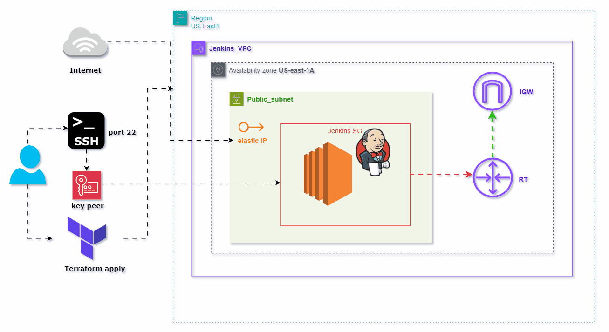
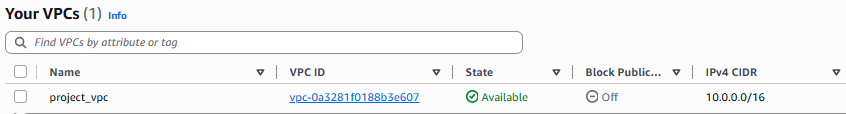
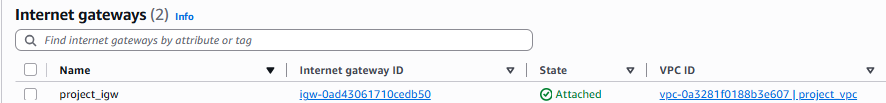
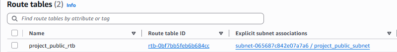
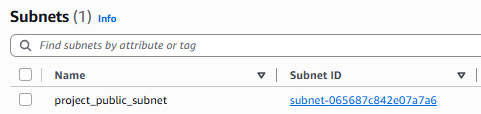
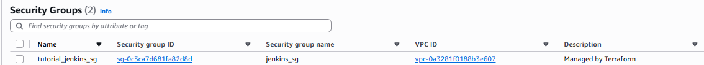
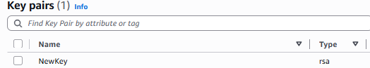
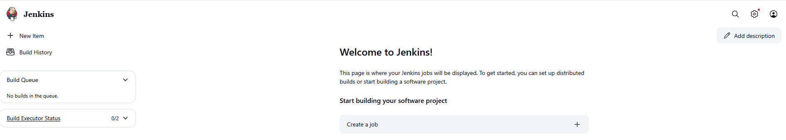

# Deploying Jenkins on AWS EC2 with Terraform

This project provides a comprehensive solution for deploying a Jenkins server on an Amazon Web Services (AWS) EC2 instance using Terraform. Jenkins is an open-source automation server that facilitates continuous integration and continuous delivery (CI/CD) for software development. This setup automates the infrastructure provisioning and application deployment, ensuring a repeatable and scalable environment for your CI/CD pipelines.



## Main Requirements

This project addresses the following key requirements for a Jenkins server deployment:

*   **EC2 Instance Deployment**: The Jenkins server will be deployed on a dedicated Amazon EC2 instance.
*   **Internet Accessibility (Port 80)**: The EC2 instance hosting Jenkins will be accessible via the internet on port 80, allowing web access to the Jenkins dashboard.
*   **SSH Access**: Secure Shell (SSH) access to the EC2 instance will be enabled for administrative purposes and troubleshooting.
*   **Terraform for Infrastructure as Code**: All infrastructure provisioning, including the VPC, subnets, security groups, and the EC2 instance itself, will be managed using Terraform, ensuring an Infrastructure as Code (IaC) approach.

## Project Steps

This project follows a structured approach to deploy the Jenkins server, encompassing the following steps:

1.  **Create the VPC**: A new Virtual Private Cloud (VPC) will be provisioned to provide an isolated network environment for the Jenkins deployment.
2.  **Create the Internet Gateway and attach it to the VPC using a Route Table**: An Internet Gateway will be created and attached to the VPC, enabling communication between the VPC and the internet. A route table will be configured to direct internet-bound traffic through the Internet Gateway.
3.  **Create a Public Subnet and associate it with the Route Table**: A public subnet will be created within the VPC, and it will be associated with the route table configured in the previous step, allowing resources within this subnet to access the internet.
4.  **Create a Security Group for the EC2 Instance**: A security group will be defined to control inbound and outbound traffic to the EC2 instance, specifically allowing access on ports 80 (HTTP) and 22 (SSH).
5.  **Create a script to automate the installation of Jenkins on the EC2 Instance**: A shell script will be developed to automate the installation and initial configuration of Jenkins on the EC2 instance upon launch.
6.  **Create the EC2 Instance and attach an Elastic IP and Key Pair to it**: An EC2 instance will be launched within the public subnet. An Elastic IP address will be associated with the instance to provide a static public IP, and a key pair will be attached for secure SSH access.
7.  **Verify that everything works**: Comprehensive verification steps will be outlined to ensure that the Jenkins server is successfully deployed, accessible, and operational.


## Prerequisites

Before you begin, ensure you have the following installed and configured:

*   **AWS Account**: An active AWS account with appropriate permissions to create VPCs, EC2 instances, security groups, and other related resources.
*   **AWS CLI**: The AWS Command Line Interface (CLI) configured with your AWS credentials. You can find installation instructions [here](https://docs.aws.amazon.com/cli/latest/userguide/getting-started-install.html).
*   **Terraform**: Terraform installed on your local machine. Download and installation instructions are available [here](https://learn.hashicorp.com/tutorials/terraform/install-cli).
*   **SSH Client**: An SSH client (e.g., OpenSSH, PuTTY) to connect to the EC2 instance.


## Architecture Overview

The architecture for this Jenkins deployment is straightforward and leverages core AWS services to provide a robust and accessible CI/CD environment. The key components include:

*   **Virtual Private Cloud (VPC)**: A logically isolated section of the AWS Cloud where you can launch AWS resources in a virtual network that you define. This provides a secure and private environment for your Jenkins server.
*   **Internet Gateway (IGW)**: A horizontally scaled, redundant, and highly available VPC component that allows communication between your VPC and the internet.
*   **Public Subnet**: A subnet within the VPC whose traffic is routed to an Internet Gateway. This is where the Jenkins EC2 instance will reside, making it accessible from the internet.
*   **Route Table**: A set of rules, called routes, that are used to determine where network traffic from your subnet or gateway is directed.
*   **Security Group**: Acts as a virtual firewall for your EC2 instance to control inbound and outbound traffic. It will be configured to allow HTTP (port 80) and SSH (port 22) access.
*   **EC2 Instance**: A virtual server in the AWS cloud that will host the Jenkins application.
*   **Elastic IP (EIP)**: A static, public IPv4 address designed for dynamic cloud computing. An EIP is associated with your AWS account, not a specific instance, and you can allocate it to an instance in your account.
*   **Key Pair**: A set of security credentials that you use to prove your identity when connecting to an EC2 instance.
```
graph TD
    A[Internet] --> B(Internet Gateway)
    B --> C(VPC)
    C --> D[Public Subnet]
    D --> E[Security Group]
    E --> F[EC2 Instance (Jenkins Server)]
    F --> G[Elastic IP]
    F --> H[Key Pair]
```

**Conceptual Flow:**

1.  Users access the Jenkins server from the **Internet**.
2.  Traffic flows through the **Internet Gateway** into the **VPC**.
3.  Within the VPC, the **Public Subnet** hosts the **EC2 Instance**.
4.  The **Security Group** acts as a firewall, allowing only necessary traffic (HTTP on port 80, SSH on port 22) to reach the EC2 instance.
5.  The **EC2 Instance** runs the Jenkins server.
6.  An **Elastic IP** provides a stable public IP address for the EC2 instance.
7.  A **Key Pair** is used for secure SSH access to the EC2 instance.


## Deployment Steps

Follow these steps to deploy the Jenkins server on AWS EC2 using Terraform.

### Step 1: Initialize Terraform and Configure AWS Provider

First, ensure you have your AWS credentials configured for Terraform. This typically involves setting environment variables (`AWS_ACCESS_KEY_ID`, `AWS_SECRET_ACCESS_KEY`, `AWS_DEFAULT_REGION`) or configuring the AWS CLI. Create a `main.tf` file and define your AWS provider:

```terraform
provider "aws" {
  region = "us-east-1" # Or your preferred AWS region
}
```

Then, initialize your Terraform working directory:

```bash
terraform init
```

### Step 2: Create the VPC

Define your Virtual Private Cloud (VPC) in your Terraform configuration. This will be the isolated network for your Jenkins server.

```terraform
resource "aws_vpc" "jenkins_vpc" {
  cidr_block = "10.0.0.0/16"
  tags = {
    Name = "jenkins-vpc"
  }
}
```


### Step 3: Create the Internet Gateway and attach it to the VPC using a Route Table

Create an Internet Gateway and attach it to your newly created VPC. Then, create a route table and add a route that directs all internet-bound traffic (0.0.0.0/0) to the Internet Gateway.

```terraform
resource "aws_internet_gateway" "jenkins_igw" {
  vpc_id = aws_vpc.jenkins_vpc.id
  tags = {
    Name = "jenkins-igw"
  }
}
```



```
resource "aws_route_table" "jenkins_route_table" {
  vpc_id = aws_vpc.jenkins_vpc.id

  route {
    cidr_block = "0.0.0.0/0"
    gateway_id = aws_internet_gateway.jenkins_igw.id
  }

  tags = {
    Name = "jenkins-route-table"
  }
}
```



### Step 4: Create a Public Subnet and associate it with the Route Table

Create a public subnet within your VPC and associate it with the route table you created. This subnet will host your Jenkins EC2 instance.

```terraform
resource "aws_subnet" "jenkins_public_subnet" {
  vpc_id                  = aws_vpc.jenkins_vpc.id
  cidr_block              = "10.0.1.0/24"
  map_public_ip_on_launch = true # Automatically assign public IP to instances launched in this subnet
  availability_zone       = "us-east-1a" # Or your preferred AZ

  tags = {
    Name = "jenkins-public-subnet"
  }
}

resource "aws_route_table_association" "jenkins_subnet_association" {
  subnet_id      = aws_subnet.jenkins_public_subnet.id
  route_table_id = aws_route_table.jenkins_route_table.id
}
```


### Step 5: Create a Security Group for the EC2 Instance

Define a security group that allows inbound traffic on port 80 (HTTP) for Jenkins access and port 22 (SSH) for administrative access. Outbound traffic will be allowed to all destinations.

```terraform
resource "aws_security_group" "jenkins_sg" {
  name        = "jenkins-security-group"
  description = "Allow HTTP and SSH inbound traffic"
  vpc_id      = aws_vpc.jenkins_vpc.id

  ingress {
    from_port   = 80
    to_port     = 80
    protocol    = "tcp"
    cidr_blocks = ["0.0.0.0/0"]
  }

  ingress {
    from_port   = 22
    to_port     = 22
    protocol    = "tcp"
    cidr_blocks = ["0.0.0.0/0"]
  }

  egress {
    from_port   = 0
    to_port     = 0
    protocol    = "-1"
    cidr_blocks = ["0.0.0.0/0"]
  }

  tags = {
    Name = "jenkins-sg"
  }
}
```


### Step 6: Create a script to automate the installation of Jenkins on the EC2 Instance

Create a shell script (e.g., `install_jenkins.sh`) that will be executed on the EC2 instance upon launch to install Java, Jenkins, and start the Jenkins service. Make sure to update the script with the latest Jenkins installation commands.

```bash
#!/bin/bash
sudo apt update -y
sudo apt install openjdk-11-jre -y
curl -fsSL https://pkg.jenkins.io/debian-stable/jenkins.io-2023.key | sudo tee \
  /usr/share/keyrings/jenkins-keyring.asc > /dev/null
echo deb [signed-by=/usr/share/keyrings/jenkins-keyring.asc] \
  https://pkg.jenkins.io/debian-stable binary/ | sudo tee \
  /etc/apt/sources.list.d/jenkins.list > /dev/null
sudo apt-get update -y
sudo apt-get install jenkins -y
sudo systemctl enable jenkins
sudo systemctl start jenkins
```

### Step 7: Create the EC2 Instance and attach an Elastic IP and Key Pair to it

Finally, define the EC2 instance, associate it with the public subnet and security group, and attach an Elastic IP and a key pair for SSH access. The `user_data` argument will execute the `install_jenkins.sh` script upon instance launch.

First, create a key pair. You can do this manually in the AWS console or using Terraform:

```terraform
resource "aws_key_pair" "jenkins_key" {
  key_name   = "jenkins-key"
  public_key = file("~/.ssh/NewKey.pub") # Replace with the path to your public SSH key
}
```


Now, define the EC2 instance:

```terraform
resource "aws_instance" "jenkins_server" {
  ami           = "ami-053b0d53c27927904" # Ubuntu Server 22.04 LTS (HVM), SSD Volume Type - us-east-1
  instance_type = "t2.medium"
  subnet_id     = aws_subnet.jenkins_public_subnet.id
  security_groups = [aws_security_group.jenkins_sg.name]
  key_name      = aws_key_pair.jenkins_key.key_name

  user_data = file("install_jenkins.sh")

  tags = {
    Name = "jenkins-server"
  }
}

resource "aws_eip" "jenkins_eip" {
  instance = aws_instance.jenkins_server.id
  vpc      = true

  tags = {
    Name = "jenkins-eip"
  }
}

output "jenkins_public_ip" {
  value       = aws_eip.jenkins_eip.public_ip
  description = "The public IP address of the Jenkins server"
}
```

After defining all these resources in your `.tf` files, run:

```bash
terraform plan
terraform apply --auto-approve
```

This will provision all the necessary AWS resources and deploy your Jenkins server.


## Verification

After Terraform successfully applies the configuration, you can verify the deployment using the following steps:

1.  **Access Jenkins Dashboard**: Open your web browser and navigate to the public IP address of your EC2 instance (obtained from the `jenkins_public_ip` output of Terraform). You should see the Jenkins unlock page.

    ```bash
    # After terraform apply, get the public IP
    terraform output jenkins_public_ip
    ```

    Then, open `http://<your-jenkins-public-ip>` in your browser.

2.  **Retrieve Initial Admin Password**: To unlock Jenkins, you'll need the initial administrator password. This is typically found in the Jenkins logs on the EC2 instance. SSH into your EC2 instance:

    ```bash
    ssh -i ~/.ssh/your-key-pair.pem ubuntu@<your-jenkins-public-ip>
    ```

    Once connected, retrieve the password:

    ```bash
    sudo cat /var/lib/jenkins/secrets/initialAdminPassword
    ```

    Copy this password and paste it into the Jenkins unlock page in your browser.

3.  **Complete Jenkins Setup**: Follow the on-screen instructions to complete the Jenkins setup, including installing suggested plugins and creating your first admin user.

4.  **Verify SSH Access**: Confirm that you can SSH into the EC2 instance using the key pair you provided during the Terraform deployment. This ensures you have administrative access to the server.

    ```bash
    ssh -i ~/.ssh/your-key-pair.pem ubuntu@<your-jenkins-public-ip>
    ```

By following these steps, you can confirm that your Jenkins server is successfully deployed, accessible, and ready for use.


## Usage and Access

Once Jenkins is installed and configured, you can access it via your web browser using the Elastic IP address assigned to the EC2 instance. You can then log in with the administrator credentials you set up during the initial Jenkins configuration.

For SSH access to the EC2 instance, use the key pair specified during the Terraform deployment.



## Cleanup

To destroy all the AWS resources created by this Terraform project, navigate to your Terraform project directory and run:

```bash
terraform destroy --auto-approve
```

**Caution**: This command will permanently delete all provisioned resources, including your Jenkins server and any data associated with it. Ensure you have backed up any critical data before running this command.

